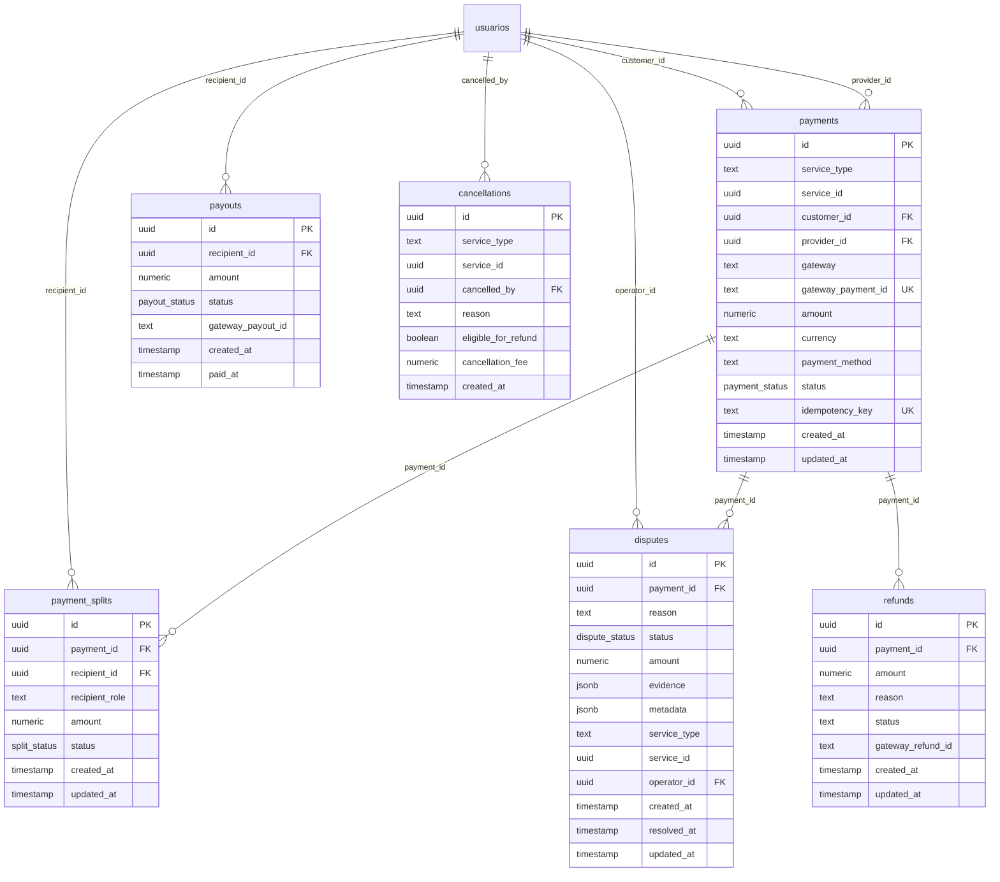

# UBT SuperApp — Auditoria do Esquema Financeiro (Supabase)

**Data do Relatório:** 2026-07-15  
**Documento:** FINANCIAL_SCHEMA_AUDIT.md  
**Versão:** v1.0  
**Classificação:** Técnico / Segurança Interna  

---

## 1. Estrutura Completa das Tabelas

Abaixo está o inventário técnico das seis tabelas do motor financeiro unificado no banco de dados remoto do Supabase (PostgreSQL).

### 1.1 `public.payments` (Pagamentos)
*   **Colunas e Tipos:**
    *   `id`: `uuid` (Primary Key, Default: `gen_random_uuid()`)
    *   `service_type`: `text` (Ex: `'mototaxi'`, `'diarista'`, `'ambulante'`, `'coco'`)
    *   `service_id`: `uuid` (ID da transação/pedido correspondente na vertical)
    *   `customer_id`: `uuid` (Foreign Key, `REFERENCES public.usuarios(id)`)
    *   `provider_id`: `uuid` (Foreign Key, `REFERENCES public.usuarios(id)`)
    *   `gateway`: `text` (Default: `'mercado_pago'`)
    *   `gateway_payment_id`: `text` (Unique, ID gerado pelo Mercado Pago)
    *   `amount`: `numeric(10,2)` (Constraint Check: `amount > 0`)
    *   `currency`: `text` (Default: `'BRL'`)
    *   `payment_method`: `text` (Constraint Check: `'pix'` ou `'credit_card'`)
    *   `status`: `payment_status` (Enum: `'pending'`, `'authorized'`, `'captured'`, `'refunded'`, `'charged_back'`, `'failed'`)
    *   `idempotency_key`: `text` (Unique, Chave para prevenção de repetição)
    *   `created_at`: `timestamp with time zone` (Default: `now()`)
    *   `updated_at`: `timestamp with time zone` (Default: `now()`)
*   **Índices:**
    *   `idx_payments_service` (`service_type`, `service_id`)
    *   `idx_payments_customer` (`customer_id`)
    *   `idx_payments_provider` (`provider_id`)
    *   `idx_payments_gateway_id` (`gateway_payment_id`)
*   **Constraints:**
    *   `payments_pkey` (PRIMARY KEY)
    *   `payments_amount_check` (`amount > 0`)
    *   `payments_payment_method_check` (`payment_method IN ('pix', 'credit_card')`)
*   **RLS (Row Level Security):**
    *   *Leitura:* Permitida apenas se o usuário logado for o cliente (`customer_id`), o prestador (`provider_id`) ou se for administrador (`public.is_admin()`).
    *   *Escrita (Inserção/Update/Delete):* Restrita apenas para administradores autorizados.
*   **Triggers:**
    *   `audit_payments_trigger` (AFTER INSERT OR UPDATE OR DELETE) ➔ Registra todas as ações na tabela `public.audit_events`.
*   **Realtime:** Habilitável nas configurações de publicação do Supabase.

### 1.2 `public.payment_splits` (Divisões de Taxas)
*   **Colunas e Tipos:**
    *   `id`: `uuid` (Primary Key)
    *   `payment_id`: `uuid` (Foreign Key, `REFERENCES public.payments(id) ON DELETE CASCADE`)
    *   `recipient_id`: `uuid` (Foreign Key, `REFERENCES public.usuarios(id)`)
    *   `recipient_role`: `text` (Constraint Check: `'provider'`, `'ubt'`, `'godparent'`, `'comunidade'`, `'prize_worker'`, `'prize_consumer'`)
    *   `amount`: `numeric(10,2)` (Constraint Check: `amount >= 0`)
    *   `status`: `split_status` (Enum: `'pending'`, `'approved'`, `'released'`, `'refunded'`, `'cancelled'`)
    *   `created_at`: `timestamp with time zone`
    *   `updated_at`: `timestamp with time zone`
*   **Índices:**
    *   `idx_payment_splits_payment` (`payment_id`)
    *   `idx_payment_splits_recipient` (`recipient_id`)
*   **Constraints:**
    *   `payment_splits_pkey` (PRIMARY KEY)
    *   `payment_splits_amount_check` (`amount >= 0`)
    *   `payment_splits_recipient_role_check`
*   **RLS:**
    *   *Leitura:* Permitida se o favorecido for o usuário autenticado (`recipient_id`), se for admin (`public.is_admin()`) ou se o usuário logado estiver associado como cliente/prestador do pagamento base.
    *   *Escrita:* Restrita a administradores.
*   **Triggers:**
    *   `audit_splits_trigger` (AFTER INSERT OR UPDATE OR DELETE) ➔ Histórico de auditoria.
*   **Realtime:** Não habilitado.

### 1.3 `public.payouts` (Saques e Repasses Consolidados)
*   **Colunas e Tipos:**
    *   `id`: `uuid` (Primary Key)
    *   `recipient_id`: `uuid` (Foreign Key, `REFERENCES public.usuarios(id)`)
    *   `amount`: `numeric(10,2)` (Constraint Check: `amount > 0`)
    *   `status`: `payout_status` (Enum: `'pending'`, `'processing'`, `'paid'`, `'failed'`)
    *   `gateway_payout_id`: `text` (ID da transferência bancária externa)
    *   `created_at`: `timestamp with time zone`
    *   `paid_at`: `timestamp with time zone`
*   **Índices:**
    *   `idx_payouts_recipient` (`recipient_id`)
*   **Constraints:**
    *   `payouts_pkey` (PRIMARY KEY)
    *   `payouts_amount_check` (`amount > 0`)
*   **RLS:**
    *   *Leitura:* Permitida apenas para o prestador favorecido (`recipient_id`) ou administradores.
    *   *Escrita:* Restrita a administradores.
*   **Triggers:**
    *   `audit_payouts_trigger` (AFTER INSERT OR UPDATE OR DELETE) ➔ Histórico de auditoria.
*   **Realtime:** Habilitado para sincronizar filas de saques no admin.

### 1.4 `public.disputes` (Contestações e Mediação)
*   **Colunas e Tipos:**
    *   `id`: `uuid` (Primary Key)
    *   `payment_id`: `uuid` (Foreign Key, `REFERENCES public.payments(id)`)
    *   `reason`: `text` (Motivo da abertura da disputa)
    *   `status`: `dispute_status` (Enum: `'opened'`, `'in_mediation'`, `'resolved_customer'`, `'resolved_provider'`, `'closed'`)
    *   `amount`: `numeric(10,2)` (Valor contestado, Constraint Check: `amount >= 0`)
    *   `evidence`: `jsonb` (Links de imagens, mensagens e evidências de arbitragem)
    *   `metadata`: `jsonb` (Logs de alteração e notas operacionais)
    *   `service_type`: `text`
    *   `service_id`: `uuid`
    *   `operator_id`: `uuid` (Foreign Key, `REFERENCES public.usuarios(id)`)
    *   `created_at`: `timestamp with time zone`
    *   `resolved_at`: `timestamp with time zone`
    *   `updated_at`: `timestamp with time zone`
*   **Índices:**
    *   `idx_disputes_payment` (`payment_id`)
    *   `idx_disputes_operator` (`operator_id`)
*   **Constraints:**
    *   `disputes_pkey` (PRIMARY KEY)
    *   `disputes_amount_check` (`amount >= 0`)
*   **RLS:**
    *   *Leitura:* Administradores ou os envolvidos (comprador/prestador) do pagamento base.
    *   *Escrita:* Exclusiva de administradores autorizados.
*   **Triggers:**
    *   Nenhum (Auditoria delegada ao logger de `refunds` e `cancellations`).
*   **Realtime:** Habilitado para alertas operacionais de contestações urgentes.

### 1.5 `public.refunds` (Estornos e Reversões)
*   **Colunas e Tipos:**
    *   `id`: `uuid` (Primary Key)
    *   `payment_id`: `uuid` (Foreign Key, `REFERENCES public.payments(id)`)
    *   `amount`: `numeric(10,2)` (Check: `amount > 0`)
    *   `reason`: `text`
    *   `status`: `text` (Check: `'pending'`, `'processed'`, `'failed'`)
    *   `gateway_refund_id`: `text` (ID gerado pelo Mercado Pago para a reversão bancária)
    *   `created_at`: `timestamp with time zone`
    *   `updated_at`: `timestamp with time zone`
*   **Índices:**
    *   `idx_refunds_payment` (`payment_id`)
*   **Constraints:**
    *   `refunds_pkey` (PRIMARY KEY)
    *   `refunds_amount_check` (`amount > 0`)
    *   `refunds_status_check` (`status IN ('pending', 'processed', 'failed')`)
*   **RLS:**
    *   *Leitura:* Administradores ou envolvidos no pagamento.
    *   *Escrita:* Restrita a administradores.
*   **Triggers:**
    *   `audit_refunds_trigger` (AFTER INSERT OR UPDATE OR DELETE).
*   **Realtime:** Não habilitado.

### 1.6 `public.cancellations` (Logs de Cancelamentos)
*   **Colunas e Tipos:**
    *   `id`: `uuid` (Primary Key)
    *   `service_type`: `text`
    *   `service_id`: `uuid`
    *   `cancelled_by`: `uuid` (Foreign Key, `REFERENCES public.usuarios(id)`)
    *   `reason`: `text`
    *   `eligible_for_refund`: `boolean`
    *   `cancellation_fee`: `numeric(10,2)` (Check: `cancellation_fee >= 0`)
    *   `created_at`: `timestamp with time zone`
*   **Índices:**
    *   `idx_cancellations_service` (`service_type`, `service_id`)
*   **Constraints:**
    *   `cancellations_pkey`
    *   `cancellations_cancellation_fee_check`
*   **RLS:**
    *   *Leitura:* Usuário que efetuou o cancelamento ou administradores.
    *   *Escrita:* Restrita a administradores.
*   **Triggers:**
    *   `audit_cancellations_trigger` (AFTER INSERT OR UPDATE OR DELETE).
*   **Realtime:** Habilitado para alertar cancelamentos no painel operacional.

---

## 2. Consumo das Tabelas (Telas React)

*   `public.payments` ➔ Consumida na listagem de compras do usuário tomador e no extrato de recebidos em `DiaristaAgendamentoPage.tsx`, `AmbulantePedidoPage.tsx` e `MototaxiTomador.tsx`.
*   `public.payment_splits` ➔ Não é lida por telas de clientes; consumida apenas na projeção e calibração de taxas em `/admin/split` e nas listagens de apuração em `/admin/sorteio/1-5` e `/admin/sorteio/1-11`.
*   `public.payouts` ➔ Disponível na aba de saldo acumulado e resgate Pix do prestador no app móvel. Habilitada na fila operacional administrativa `/admin/payouts` (v2.0).
*   `public.disputes` ➔ Exibida na aba de tickets de suporte do app cliente. Consumida pela tela administrativa `/admin/arbitragem`.
*   `public.refunds` ➔ Apresentada como sinalizador visual de estorno no extrato de compras do cliente.
*   `public.cancellations` ➔ Visualizada em históricos operacionais gerais do backoffice admin.

---

## 3. Escrita das Tabelas (Edge Functions)

*   `/checkout` ➔ Escreve em `public.payments` (status `pending`) e cria a projeção em `public.payment_splits`.
*   `/webhooks-mercado-pago` ➔ Escreve a confirmação em `public.payments` (status `captured` ou `failed`) e atualiza splits para `approved` / `released`.
*   `/refund` ➔ Escreve em `public.refunds`, atualiza status em `public.payments` (para `refunded`), `public.payment_splits` (para `refunded` / `cancelled`) e atualiza a disputa associada em `public.disputes` para `resolved_customer` / `closed`.
*   `/daily-payout` ➔ Agrupa splits em status `released` e insere novos registros na tabela `public.payouts` (status `pending`).

---

## 4. Status de Integração do Mercado Pago

> [!NOTE]
> **Integração Pilot Sandbox:** Atualmente, as chamadas às APIs do Mercado Pago nas Edge Functions são simulações robustas e mocks estruturados que emulam os retornos oficiais do gateway e seus webhooks. Isso possibilita testar o fluxo de ponta a ponta sem tráfego de cartões de crédito reais nesta etapa de homologação. O motor financeiro está preparado para receber chaves Pix de produção do Mercado Pago e tokens de produção.

---

## 5. Diagrama de Entidades (Mermaid ER)

---

## 6. Classificação de Prontidão

| Tabela | Classificação | Justificativa |
| :--- | :--- | :--- |
| `public.payments` | 🟢 **Production Ready** | Totalmente tipada, possui RLS hardened, chaves de idempotência robustas e indexadores eficientes. |
| `public.payment_splits` | 🟢 **Production Ready** | RLS segura protegendo a leitura do mototaxista, constraints rígidas de percentual de split. |
| `public.payouts` | 🟡 **Pilot Ready** | A tabela é segura e operacional. Prontidão para produção depende da integração com APIs reais de payout Pix do Mercado Pago. |
| `public.disputes` | 🟢 **Production Ready** | Colunas de metadados, evidências em JSONB e segurança robusta de leitura baseada em envolvidos na transação. |
| `public.refunds` | 🟢 **Production Ready** | Modelagem robusta garantindo que estornos nunca excedam o valor original do pagamento. |
| `public.cancellations` | 🟢 **Production Ready** | Armazena taxas e carências com triggers automáticos de log. |

---

## 7. Gargalos Esperados acima de 100 Mil Registros

1.  **Crescimento do Histórico de Auditoria (`audit_events`):**
    *   *Problema:* O trigger `log_financial_audit()` roda em todas as modificações nas tabelas financeiras, gravando o payload completo com `row_to_json`. Com 100k transações, a tabela `audit_events` conterá mais de 300k registros (inserts/updates/deletes) e causará latência nas escritas de checkout e webhook por causa da execução síncrona do trigger.
    *   *Solução:* Particionar a tabela `audit_events` por ano/mês ou desativar updates na auditoria, mantendo apenas logs de inserção inicial.
2.  **Saturação do Canal de Transações Sem Paginação:**
    *   *Problema:* O painel administrativo atual lê os pagamentos com seleções completas (`.select('*')`). Com mais de 100k registros, o navegador do administrador sofrerá estouro de memória e congelamento.
    *   *Solução:* Implementar paginação com cursor ou offset obrigatória de no máximo 100 registros por bloco na listagem administrativa.
3.  **Falta de Índices Compostos:**
    *   *Problema:* Consultar splits de um prestador filtrando por status (ex: splits `approved` pendentes de payout) exigirá varreduras completas no índice (`Index Scan` seguido de `Filter`).
    *   *Solução:* Criar índice composto na tabela `payment_splits` composto por: `CREATE INDEX idx_splits_recip_status ON public.payment_splits (recipient_id, status);`.
4.  **Varreduras de RLS Existenciais (Subqueries):**
    *   *Problema:* A política RLS de `payment_splits` e `disputes` executa subconsultas `EXISTS (SELECT 1 FROM public.payments WHERE id = ...)` para verificar se o usuário é participante do pagamento base. Isso é executado para **cada linha retornada**. Em grandes consultas, causará sobrecarga extrema na CPU do banco.
    *   *Solução:* Cachear relacionamentos em tokens JWT ou reestruturar as subconsultas RLS.
