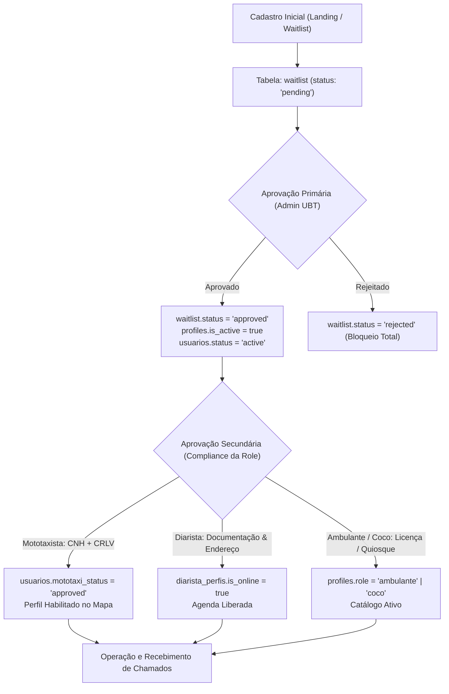
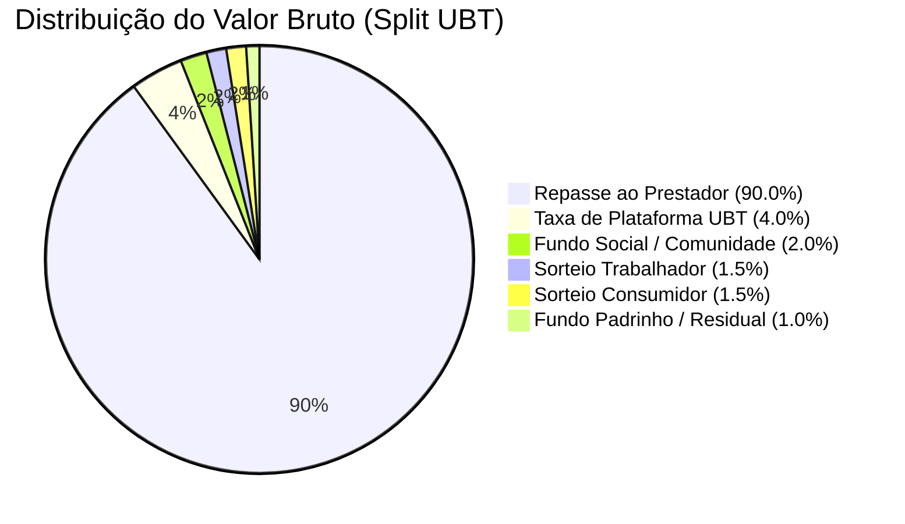

# Relatório de Estado Atual: Arquitetura, Onboarding, Serviços e Motor Financeiro

**Projeto:** UBT SuperApp (PWA & Backend Supabase)  
**Data da Auditoria:** 04 de Setembro de 2026  
**Ambiente:** Homologação / Produção  
**Branch de Trabalho:** `feature-urgente-atualizacao`

---

## Sumário Executivo

Este documento consolida a auditoria técnica exaustiva realizada sobre o ecossistema UBT (código-fonte Front-end React/TypeScript, Supabase Edge Functions e esquemas de banco de dados PostgreSQL). O objetivo é fornecer um diagnóstico preciso das regras de negócio, tabelas, travas de segurança e integrações vigentes para nivelamento da equipe de engenharia.

---

## 1. Fluxo de Onboarding (Dupla Aprovação)

O onboarding no UBT opera sob um modelo de **Dupla Aprovação** (*Gatekeeper Dual-Stage*), garantindo que nenhum prestador de serviço atue operacionalmente ou receba chamados sem antes passar pela validação cadastral da plataforma (UBT) e pelo compliance regulatório da categoria profissional (Role KYC).



### 1.1. Estrutura de Tabelas e Flags de Controle

| Tabela | Coluna / Flag | Tipo | Valores Válidos | Descrição / Papel no Onboarding |
| :--- | :--- | :--- | :--- | :--- |
| **`public.waitlist`** | `status` | `text` | `'pending'`, `'approved'`, `'rejected'` | **Aprovação Primária (UBT):** Controla a fila de espera global. |
| `public.waitlist` | `approved_at` | `timestamptz` | `timestamp` ou `null` | Registro de data/hora da liberação pela administração. |
| `public.waitlist` | `approved_by` | `uuid` | `auth.users.id` | Identificador do SuperAdmin que concedeu o acesso. |
| **`public.profiles`** | `is_active` | `boolean` | `true`, `false` | **Flag Master de Ativação:** Se `false`, o usuário é bloqueado em todos os módulos. |
| `public.profiles` | `role` | `text` | `'super_admin'`, `'admin'`, `'mototaxi'`, `'diarista'`, `'ambulante'`, `'coco'`, `'tomador'` | Papel formal atribuído após validação. |
| **`public.usuarios`** | `status` | `text` | `'active'`, `'pending'`, `'blocked'`, `'rejected'` | Status operacional no subsistema legado/core. |
| `public.usuarios` | `mototaxi_status` | `text` | `'kyc-pending'`, `'approved'`, `'none'` | **Aprovação Secundária (Mototáxi):** Validação de CNH e documento do veículo. |
| **`public.diarista_perfis`**| `is_online` | `boolean` | `true`, `false` | Habilitação da diarista para ser listada e receber propostas. |

### 1.2. Lógica de Bloqueio de Acesso

#### No Front-end (Middlewares & Route Guards):
1. **`useCurrentUser.ts`**: Resolve o usuário autenticado e extrai `status`, `role`, `kycStatus` e `mototaxiActive`.
2. **`PrestadorRoute.tsx` & `AdminRoute.tsx`**:
   * Se o usuário não tiver `is_active === true` ou estiver com status `'pending'`, é redirecionado para a tela de espera (`/waitlist-status`) ou tela de onboarding com banner de bloqueio.
   * Se for mototaxista com `mototaxi_status !== 'approved'`, a tela de mapa online (`PrestadorMototaxiOnline.tsx`) bloqueia a ativação do botão *"Ficar Online"* e direciona para o envio de documentos.

#### No Back-end (Row Level Security - RLS):
* **`public.waitlist`**: Leitura restrita a administradores (`role IN ('admin', 'super_admin')`) e inserção anônima permitida para novos cadastros.
* **`public.mototaxi_sessoes`**: Apenas prestadores com perfil ativo e autenticado podem inserir ou atualizar coordenadas de sessão online.
* **`public.mototaxi_corridas`**: Usuários comuns (tomadores) só podem ler suas próprias corridas (`tomador_id = auth.uid()`). Apenas prestadores online e com KYC aprovado conseguem listar chamados com `status = 'searching'`.

---

## 2. Fluxo de Contratação (Ambulante, Mototaxista, Diarista)

O ecossistema UBT atende a 3 verticais de serviços sob demanda, cada uma com ciclo de vida e modelo de contratação próprios.

### 2.1. Ciclo de Vida do Pedido e Mapeamento de Status

```
[ Mototáxi ] : searching  ────────> accepted ──────> in_progress ──────> completed (ou cancelled)
[ Diarista ] : pending    ────────> confirmed ─────> in_progress ──────> completed (ou rejected/cancelled)
[ Ambulante ]: pending    ────────> accepted ──────> preparing ────────> delivering ────> completed
```

#### Tabela Comparativa de Ordens por Vertical:

| Vertical | Tabela do Banco | Status Operacionais Mapeados | Status de Pagamento Mapeados |
| :--- | :--- | :--- | :--- |
| **Mototáxi** | `public.mototaxi_corridas` | `searching` (buscando motorista)<br>`accepted` (corrida aceita)<br>`in_progress` (em trajeto)<br>`completed` (finalizada)<br>`cancelled` (cancelada) | `pending`<br>`authorized`<br>`paid`<br>`failed`<br>`refunded` |
| **Diarista** | `public.diarista_agendamentos` | `pending` (aguardando confirmação)<br>`confirmed` (aceito pela diarista)<br>`in_progress` (faxina em andamento)<br>`completed` (concluída)<br>`cancelled`<br>`rejected` | `pending`<br>`paid`<br>`refunded` |
| **Ambulante / Alimentos** | `public.ambulante_pedidos` e `public.pedidos` | `pending` (pedido enviado ao quiosque)<br>`accepted` (pedido aceito)<br>`preparing` (em preparo)<br>`delivering` (a caminho na praia)<br>`completed` (entregue)<br>`cancelled` | `pending`<br>`paid`<br>`failed` |

### 2.2. Lógica de Matchmaking e Notificação

1. **Mototáxi (Match Geográfico em Tempo Real)**:
   * O cliente define origem e destino em `MototaxiTomador.tsx`, calculando distância via fórmula Haversine e preço tabelado via `calcPrice(km)`.
   * A corrida é inserida em `mototaxi_corridas` com `status: 'searching'`.
   * O canal Supabase Realtime (`public:mototaxi_corridas` com filtro `status=eq.searching`) dispara uma notificação via WebSocket para os prestadores com sessão ativa em `mototaxi_sessoes`.
   * **Trava Concorrencial Anti-Corrida Dupla**: O aceite em `PrestadorMototaxiOnline.tsx` executa um update atômico com validação estrita:
     ```typescript
     .from('mototaxi_corridas')
     .update({ status: 'accepted', prestador_id: user.uid, accepted_at: new Date().toISOString() })
     .eq('id', chamado.id)
     .eq('status', 'searching')
     .is('prestador_id', null)
     .select('id')
     .single();
     ```
     Se outro motorista aceitar uma fração de segundo antes, o update retorna erro e o chamado é fechado.

2. **Diarista (Agendamento Direto por Perfil)**:
   * O tomador pesquisa por bairro, data e metragem quadrada ($m^2$) em `DiaristaAgendarPage.tsx`.
   * O pedido é vinculado diretamente ao `prestador_id` da diarista selecionada.
   * A diarista recebe o convite em `DiaristaAgendaPage.tsx` e confirma ou recusa a data.

3. **Ambulante (Quiosque / Venda na Areia)**:
   * O cliente monta o carrinho em `AmbulanteCarrinhoPage.tsx` e envia as coordenadas GPS da sua barraca/guarda-sol (`tomador_location`).
   * O ambulante recebe o chamado com mapa de localização na areia e atualiza as etapas (`preparing` ➔ `delivering` ➔ `completed`).

---

## 3. Motor de Pagamento & Split (Mercado Pago)

O modelo financeiro da UBT adota o **Split de Pagamentos Nativo** (*Marketplace Multi-Split*), onde cada transação é fracionada em centavos no momento da liquidação.

### 3.1. Regras de Negócio e Porcentagens de Split

As porcentagens são governadas centralmente na tabela `public.split_config` (com fallback regulatório `REGULATORY_DEFAULTS` na Edge Function `payment-gateway`):



| Beneficiário / Conta | Percentual Regulatório | Coluna em `split_config` | Papel no Fluxo Financeiro |
| :--- | :--- | :--- | :--- |
| **Prestador do Serviço** | **90,00 %** | `prestador_pct` | Valor líquido repassado ao trabalhador da ponta. |
| **Taxa Plataforma (UBT)** | **4,00 %** | `ubt_pct` | *Take Rate* da UBT para custeio operacional e tecnologia. |
| **Entidade / Comunidade** | **2,00 %** | `comunidade_pct` | Doação para entidades locais de Ubatuba (Santa Casa, Lar dos Velhinhos). |
| **Sorteio Trabalhador** | **1,50 %** | `premio_trabalhador_pct` | Fundo acumulado para premiação mensal dos melhores prestadores. |
| **Sorteio Consumidor** | **1,50 %** | `premio_consumidor_pct` | Fundo acumulado para sorteios de incentivo aos usuários. |
| **Padrinho / Residual** | **1,00 %** | `padrinho_pct` | Bônus de indicação e **Balde Residual** de compensação de arredondamento. |

### 3.2. Absorção de Taxas Operacionais & Arredondamento

1. **Garantia de Integridade de Centavos**:
   * A função `calculateSplitAmounts` calcula cada fatia arredondada a 2 casas decimais (`Math.round(v * 100) / 100`).
   * O balde do `padrinho_amount` absorve qualquer desvio de dízima periódica:
     ```typescript
     const sumBeforePadrinho = r(prestador_amount + ubt_amount + comunidade_amount + premio_trabalhador + premio_consumidor);
     const padrinho_amount = r(Math.max(0, totalAmount - sumBeforePadrinho));
     ```
2. **Absorção das Taxas do Gateway**:
   * O Mercado Pago debita sua taxa de processamento (Pix: ~0,99%, Cartão: ~3,99% a 4,99%) da `application_fee` da plataforma (`total_amount - prestador_amount`).
   * O prestador recebe seus **90,00% integrais** sem desconto das tarifas bancárias de emissão.

### 3.3. Contas Conectadas e Armazenamento de Credenciais (OAuth)

* **Identificação do Prestador**: As chaves Pix e identificadores de recebimento são persistidos nas colunas `profiles.pix_key` e `usuarios.pix_key`.
* **Sub-contas Mercado Pago**: A integração suporta a emissão via credencial Master da UBT (`MP_ACCESS_TOKEN_TEST` / `MP_ACCESS_TOKEN_PROD`) registrando o `external_reference` único em `pagamentos_split` e `payment_splits` para conciliação contábil individualizada.

### 3.4. Sincronização e Edge Function de Webhook (IPN)

* **Edge Function `payment-webhook`**:
  * **Segurança Anti-Spoofing**: Não confia cegamente no corpo do webhook. Ao receber a notificação, consulta a API canônica do Mercado Pago (`GET /v1/payments/{id}`) utilizando a secret `MP_ACCESS_TOKEN_TEST`.
  * **Validação de Assinatura HMAC**: Suporta validação do cabeçalho `x-signature` com a chave `MP_WEBHOOK_SECRET`.
  * **Idempotência Atômica**: Registra cada evento na tabela `marketplace_webhook_events`. Eventos repetidos (mesmo `event_id`) são descartados imediatamente com HTTP 200, prevenindo duplicidade de saldo.
  * **Atualização de Status**: Ao confirmar o status `approved`, atualiza atomicamente `pagamentos_split.status = 'approved'` e sincroniza a ordem de serviço correspondente.

---

## 4. Observabilidade & Métricas (Painel Admin)

O módulo administrativo da UBT (`AdminFinanceiroPage.tsx`, `AdminDashboard.tsx` e `AdminOperacoesPage.tsx`) possui painéis para auditoria financeira e telemetria operacional.

### 4.1. Consultas e Métricas de Negócio

1. **Volume Bruto Transacionado (GMV)**:
   * Agregação das transações confirmadas em `pagamentos_split` e `mototaxi_corridas`/`diarista_agendamentos`.
   * Suporte a filtros temporais: *Semana (7d)*, *Mês (30d)*, *Ano (365d)* e *Histórico Total*.
2. **Receita Líquida UBT (*Take Rate*)**:
   * Somatório das fatias `ubt_amount` em `pagamentos_split` onde `status = 'approved'`.
3. **Fundos de Premiação e Doações Comunitárias**:
   * Totalizadores em tempo real de `prize_worker_amount`, `prize_consumer_amount` e `entity_amount`.

### 4.2. Rastreabilidade de Falhas e Auditoria

1. **Tabela `public.admin_audit_logs`**:
   * Registra toda ação executada por gestores no painel (alteração de percentuais de split, aprovações de cadastro, estornos manuais).
   * Armazena `admin_id`, `admin_email`, `acao`, `categoria`, `valor_anterior`, `valor_novo`, `ip`, `user_agent` e `criticidade` (`INFO`, `WARN`, `CRITICAL`).
2. **Tabela `public.financial_audit_logs`**:
   * Logs imutáveis de cada tentativa de geração de pagamento, falha de gateway e eventos de webhook rejeitados.
3. **Tabela `public.marketplace_webhook_events`**:
   * Histórico de recepção de webhooks do Mercado Pago, rastreando tentativas (`attempts`), tempo de processamento e hash de payload (`payload_hash`).

---

## 5. Matriz de Configurações e Variáveis de Ambiente (Secrets)

| Variável / Secret | Escopo | Finalidade |
| :--- | :--- | :--- |
| `SUPABASE_URL` | Edge Functions / Front | URL da instância PostgreSQL/PostgREST. |
| `SUPABASE_ANON_KEY` | Front-end | Chave pública do cliente Supabase. |
| `SUPABASE_SERVICE_ROLE_KEY` | Edge Functions | Chave com privilégios administrativos para gravação de auditoria e bypass RLS interno. |
| `MP_ACCESS_TOKEN_TEST` | Edge Functions | Token de integração da API do Mercado Pago (Sandbox/Dev). |
| `MP_WEBHOOK_SECRET` | Edge Functions | Chave de assinatura para validação do cabeçalho `x-signature` dos webhooks de pagamento. |
| `OMNICHANNEL_ANSWER_ENGINE_SECRET` | Edge Functions | Chave de autenticação HMAC-SHA256 para o motor Omnichannel Server-to-Server. |
| `RESEND_API_KEY` | Edge Functions | Chave para entrega real de e-mails transacionais (pendente no backlog). |

---

## 6. Conclusão & Recomendações para a Próxima Branch

1. **Pronto para Uso**: O fluxo de roteamento, proteções de rota (RBAC normalizado para `super_admin` e `admin`), motor de mensageria com autenticação híbrida (JWT + HMAC) e cálculo de split multi-entidades estão íntegros e validados.
2. **Pontos de Atenção**:
   * As chaves externas de envio real de e-mail/WhatsApp (`RESEND_API_KEY`, etc.) permanecem mapeadas no [`BACKLOG.md`](file:///C:/Users/MacInBox/Documents/profissional/ubt/pwa/BACKLOG.md) para inserção pela equipe de infraestrutura.
   * O banco de homologação (`xqujubbqcfqxkfczbidq`) está 100% alinhado com o esquema de produção (`bfqidoduceusbqlnrsol`).
