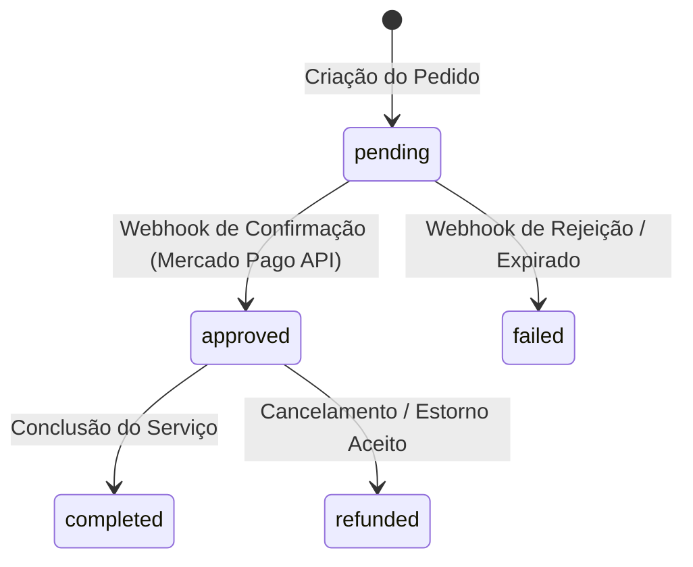
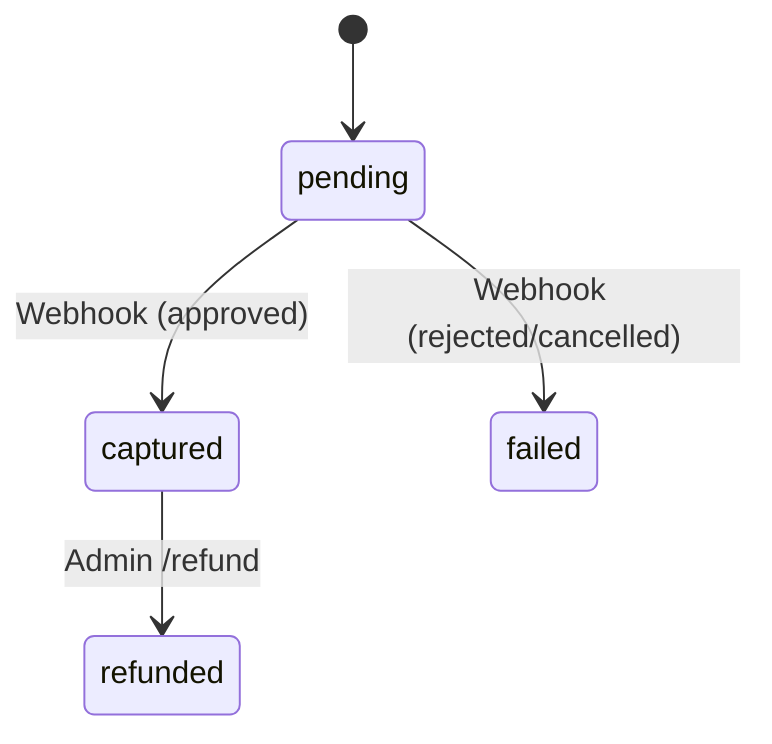

# UBT-PAY-002-ARCHITECTURE-REMEDIATION-REPORT

## 1. Executive Summary
Este relatório define as diretrizes de remediação arquitetural para a integração de pagamentos e split da plataforma UBT com a Sandbox e a Produção do Mercado Pago. Com base no diagnóstico **UBT-PAY-001**, o objetivo é corrigir as vulnerabilidades de integridade transacional do fluxo atual (bypass no frontend e mocks estáticos no backend), estabelecer a separação absoluta de ambientes e modelar os contratos da API de Split/Marketplace Connect sob conformidade de segurança e LGPD.

---

## 2. Current Payment Architecture
A arquitetura de pagamento existente é essencialmente simulada. 
- O frontend envia dados de checkout para a Edge Function `/checkout`.
- A Edge Function `/checkout` insere um registro de pagamento mockado na tabela `payments` e divide o valor de forma estática (90% prestador, 4% UBT) na tabela `payment_splits`.
- Se a Edge Function falhar, o frontend executa um script de fallback inserindo dados diretamente na tabela legada `pagamentos_split`.

---

## 3. Current Payment Flow
- **Insegurança Transacional:** O cliente confirma o pagamento de forma client-side. Assim que o usuário clica em "Confirmar Pagamento", o frontend imediatamente marca a transação como `"confirmed"` e avança o estado operacional para avaliação, independente do sucesso real ou erros retornados pela Edge Function no backend.

---

## 4. Current Split Architecture
- **Configuração Desacoplada:** Os percentuais de repasse configurados na interface `/admin/split` são salvos somente no `localStorage` do navegador do operador.
- **Divisão Hardcoded:** A Edge Function real ignora o `localStorage` e a tabela `split_config` no banco de dados, aplicando coeficientes fixos chumbados no código (`amount * 0.90` e `amount * 0.04`).
- **Omissão de Contas:** Os repasses para as Associações, Padrinho/Madrinha e prêmios (Trabalhador e Consumidor) não são processados.

---

## 5. Financial Model (Modelo Econômico da UBT)
O modelo econômico estabelecido para repasse da taxa operacional de serviço global de 10% é o seguinte:

```text
[ Valor Pago pelo Tomador ]
    │
    ├── Prestador (Diarista/Motorista/Ambulante): 90% (Default)
    └── Taxa Operacional Global UBT: 10%
            │
            ├── UBT (Comissão de Intermediação): 5% (Default)
            ├── Associação / Comunidade: 2% (Default)
            ├── Padrinho / Madrinha: 1% (Default)
            ├── Prêmio Trabalhador (Sorteios): 1% (Default)
            └── Prêmio Consumidor (Sorteios): 1% (Default)
```
- **[DECISÃO NECESSÁRIA]:** Definir se a base de cálculo para a comissão UBT e demais prêmios incidirá sobre o valor bruto do serviço ou sobre o valor líquido deduzido das taxas de transação do Mercado Pago.

---

## 6. Mercado Pago Fees (Taxas de Processamento)
As taxas cobradas pelo Mercado Pago são independentes da comissão UBT de 5%:
- **Pix (Imediato):** 0,99%
- **Cartão de Crédito (Na hora):** 4,98%
- **Boleto (Fixo):** R$ 3,49 por transação.
- **Enforcement:** O Tomador visualizará a composição de taxas na tela de checkout antes da confirmação do pagamento:
  `VALOR DO SERVIÇO` + `TAXA DE MEIO DE PAGAMENTO` = `VALOR TOTAL A PAGAR`.

---

## 7. Split 1:1 vs Split 1:N
- **Split 1:1:** O valor é dividido entre a conta principal (Marketplace UBT) e o Prestador secundário.
- **Split 1:N:** Divisão simultânea para múltiplos recebedores (Prestador, UBT, Associação, Padrinho, etc.).
- **[VALIDAÇÃO COMERCIAL MERCADO PAGO NECESSÁRIA]:** A documentação técnica oficial de Split Payments em APIs Transparentes impõe limites de faturamento e número máximo de splits (geralmente restrito a 5 recebedores por pagamento). Caso a API bloqueie splits para 6 destinatários simultâneos, a plataforma UBT precisará reter os valores de prêmios (2%) e Padrinho (1%) na conta central e distribuí-los contábil ou programaticamente por payouts periódicos offline.

---

## 8. Marketplace Connect / OAuth
O vínculo de contas do prestador à UBT para recebimento de split utiliza o protocolo **OAuth**:
1. **Redirecionamento:** O prestador clica em "Conectar Mercado Pago" no app e é redirecionado para a página de login do Mercado Pago.
2. **Consentimento:** O prestador autoriza a aplicação UBT a realizar cobranças/splits.
3. **Token Exchange:** Mercado Pago redireciona de volta à UBT com um `code` temporário. O backend da UBT troca esse código via POST pelo `access_token` e `user_id` do prestador.
4. **Persistência:** Os tokens e dados de identificação da conta conectada são salvos com criptografia no banco de dados.

---

## 9. Prestador Already Has Mercado Pago
Se o prestador já possuir conta (Pessoa Física ou Pessoa Jurídica), o fluxo OAuth realiza a vinculação instantaneamente através de suas credenciais de login existentes no Mercado Pago.

---

## 10. LGPD / Data Minimization
- **Minimização de Dados:** A UBT compartilhará com o Mercado Pago exclusivamente as informações requeridas para KYC e transações (CPF/CNPJ, Nome, E-mail do pagador/recebedor). Dados cadastrais particulares adicionais permanecem blindados na plataforma UBT.

---

## 11. Payment Integrity (Integridade Transacional)
O frontend não poderá alterar o status do pedido de forma autônoma. A liberação de agendamentos e corridas seguirá uma máquina de estados robusta baseada em webhooks:



---

## 12. Frontend Payment Risks
Para erradicar os riscos de violação de dados ou simulação de pagamentos, a tela do PWA:
- Não terá acesso à service_role_key do Supabase.
- Não terá permissão de escrita em `payments`, `payment_splits` ou `pagamentos_split`.
- Apresentará estado de carregamento "Aguardando Confirmação Pix..." até que receba um sinal em tempo real (Supabase Realtime) disparado pelo webhook seguro no backend.

---

## 13. Webhook Architecture
A Edge Function `/webhooks-mercado-pago` validará a assinatura criptográfica para evitar ataques de spoofing:
- **Assinatura:** Captura o cabeçalho `x-signature` (HMAC-SHA256).
- **Validação:** Recria a assinatura com a chave secreta cadastrada e rejeita requisições divergentes.
- **Consulta Reversa:** Após a validação da assinatura, a Edge Function consulta diretamente a API oficial do Mercado Pago para conferir o status do pagamento antes de gravá-lo como aprovado.

---

## 14. Sandbox Architecture
Os testes locais utilizarão o ambiente isolado **Mercado Pago Sandbox**:
- **Cartões de Teste:** Emprego exclusivo da lista de números oficiais de teste do Mercado Pago para simulação de transações aprovadas e recusadas por falta de fundos.
- **Contas Virtuais:** Utilização de contas faker de comprador e vendedor geradas na Sandbox.

---

## 15. Production Architecture
No ambiente produtivo:
- O frontend consome apenas a chave pública (`MP_PUBLIC_KEY`).
- Todas as requisições autenticadas para o Mercado Pago são despachadas por Deno Edge Functions utilizando o Access Token privado (`MP_ACCESS_TOKEN`) armazenado criptografado no Supabase Vault.

---

## 16. Environment Separation (Separação de Ambientes)
Garantido por variáveis de ambiente distintas:
- **Sandbox (Desenvolvimento/Localhost):** Configurada com `MP_ENV=sandbox` e credenciais de teste com prefixo `TEST-`.
- **Produção:** Configurada com `MP_ENV=production` e credenciais reais com prefixo `APP_USR-`.
- **Prevenção de Erros:** O backend validará o prefixo dos tokens antes de despachar chamadas para evitar chaveamento indevido de produção em localhost.

---

## 17. Security Architecture
- **Tokens OAuth do Prestador:** Salvos na tabela `payment_provider_accounts`. Os campos de tokens serão criptografados em banco usando extensões pg_crypto com chaves privadas injetadas dinamicamente via variáveis de ambiente.

---

## 18. Financial Data Model (Sugerido)
A modelagem futura para splits dinâmicos e taxas inclui:
- `payments`: Armazena dados do pagamento principal, status da ordem e ids do Mercado Pago.
- `payment_splits`: Registra as distribuições em R$ para os 6 destinos (Prestador, UBT, Associação, etc.).
- `payment_provider_accounts`: Vincula o `user_id` do prestador a suas credenciais e tokens OAuth.

---

## 19. Admin Observability Impact
O novo BackOffice precisará monitorar os fluxos reais de pagamento nas seguintes telas:
- `/admin/health`: Monitoramento de latência e taxa de erros nas chamadas de webhook do Mercado Pago.
- `/admin/operacoes`: Visualização em tempo real de transações pendentes de Pix e alertas de estornos solicitados.
- `/admin/auditoria`: Auditoria das assinaturas criptográficas dos webhooks.
- `/admin/security`: Controle de tentativas de spoofing ou inserções client-side indevidas.

---

## 20. Admin Metrics
- Volume Total Transacionado (Base + Extras).
- Índice de Retenção de splits por destinatário.
- Taxa de conversão por meio de pagamento (Pix vs Cartão).

---

## 21. Admin Alerts
- **Token Expirado:** Notificação quando o refresh token de um prestador falhar na renovação OAuth.
- **Split Divergente:** Divergências entre o valor de split calculado e o valor líquido repassado pelo Mercado Pago.
- **Webhook Inativo:** Alerta se a plataforma deixar de receber pings do webhook por mais de 10 minutos.

---

## 22. Audit / Antifraud Impact
- Eventos de atualização de status de pagamento geram audit logs imutáveis na tabela `public.audit_events`.
- Métodos antifraude coletam o device fingerprint do cliente no frontend e o anexam como metadados adicionais na criação do checkout.

---

## 23. Prize / Internal Accounting
- **NÃO SUPORTADO VIA API / CONTROLE INTERNO NECESSÁRIO:** A funcionalidade de "Caixinhas" do Mercado Pago não possui API pública para automação. A retenção das frações de prêmios (1.5% ou 1% cada) será gerida contábil e internamente no banco de dados UBT, mantendo os recursos consolidados na conta principal da empresa.

---

## 24. Existing Database Structures
- **`public.pagamentos_split` (Migration 5):** Legada, com escrita direta pelo frontend. Recomendado plano de migração para descontinuação.
- **`public.payment_splits` (Migration 10):** Tabela principal de splits. Ativa e funcional.
- **`public.split_config`:** Armazena as proporções válidas no banco de dados.

---

## 25. Recommended Data Model
Consolidar a estrutura financeira baseando-se estritamente na tabela de produção `public.payment_splits`, desativando escritas diretas na tabela `pagamentos_split`.

---

## 26. Recommended State Machine
Transições de estado controladas centralizadamente por webhook:



---

## 27. Recommended Transaction Flow
1. Cliente inicia checkout -> backend insere em `payments` com status `pending`.
2. Backend dispara POST de criação de pagamento ao Mercado Pago e devolve QR Code ao cliente.
3. Cliente efetua o pagamento no banco.
4. Webhook do Mercado Pago notifica a Edge Function de sucesso.
5. Edge Function atualiza `payments` para `captured`, muda `payment_splits` para `approved` e atualiza a tabela operacional correspondente para `completed` (liberação em tempo real via Supabase Realtime).

---

## 28. Migration Plan — NOT EXECUTED
Caso decidamos migrar a tabela legada:
1. Criar migration `36_decommission_legacy_split.sql`.
2. Executar script de migração movendo dados remanescentes de `pagamentos_split` para `payment_splits`.
3. Adicionar view de compatibilidade e descontinuar a tabela física antiga.

---

## 29. Sandbox Test Matrix
- **Cenário 1:** Pix pago com sucesso -> Webhook captura -> Pedido concluído.
- **Cenário 2:** Cartão recusado por falta de fundos (Test Card `FUND`) -> Interface apresenta erro -> Pedido bloqueado.
- **Cenário 3:** Webhook duplicado -> Validação de idempotência bloqueia reprocessamento -> Retorna HTTP 200 ao Mercado Pago.

---

## 30. Wiki Actions to Document
Esta seção descreve as ações operacionais humanas que serão posteriormente documentadas na Knowledge Base:

- **USUÁRIO RESPONSÁVEL:** Prestador de Serviços.
- **AÇÃO:** Vinculação de Conta Mercado Pago.
- **TELA/LOCAL:** Perfil do Prestador / Configurações.
- **RESULTADO ESPERADO:** Autorização concluída via OAuth e status "Conectado".
- **ERROS POSSÍVEIS:** Expiração da sessão do Mercado Pago ou credencial inválida.
- **COMO RESOLVER:** Refazer o fluxo clicando em "Reconectar Conta".
- **IMPACTO NO SISTEMA:** Habilita o prestador a receber chamadas de serviço e splits de Pix.

---

## 31. Implementation Plan (Próxima Wave)
A implementação do Mercado Pago Sandbox (**UBT-PAY-002**) ocorrerá da seguinte forma:
- **Etapa 1:** Substituir os mocks locais nas Edge Functions `/checkout` e `/webhooks-mercado-pago` por chamadas à API da Sandbox do Mercado Pago.
- **Etapa 2:** Desativar fallbacks client-side diretos no frontend.
- **Etapa 3:** Criar tela e rota de callback do Onboarding OAuth.

---

## 32. Riscos
- **Instabilidade de Conexão no Pix:** Atrasos de processamento do webhook do Mercado Pago podem reter a tela do usuário em carregamento prolongado.
- **Limites de Contas no Split:** Rejeição de transação de split na Sandbox caso a conta teste do recebedor não esteja 100% ativa.

---

## 33. Decisões/Aprovações Requeridas
- **Base de Cálculo:** Decisão do PO se a comissão UBT e demais prêmios incidem sobre o valor bruto ou líquido.
- **Configuração de Taxas:** Confirmação do PO se os percentuais de sorteio de prêmios devem ser alterados de 1.5% (atual banco) para 1% (solicitação em checklist).

---

## 34. Unknowns
- `UNKNOWN`: A quantidade limite de splits em APIs transparentes suportados nativamente pelo Mercado Pago sem restrição cadastral.

---

## 35. External Documentation Sources
- **Portal do Desenvolvedor Mercado Pago:** `https://www.mercadopago.com.br/developers/pt/docs`
- **Mercado Pago Checkout API:** `https://www.mercadopago.com.br/developers/pt/docs/checkout-api/integration-test/sandbox`
- **Mercado Pago OAuth:** `https://www.mercadopago.com.br/developers/pt/docs/marketplace-connect/oauth`
- **Consulta Realizada em:** 2026-08-06.
