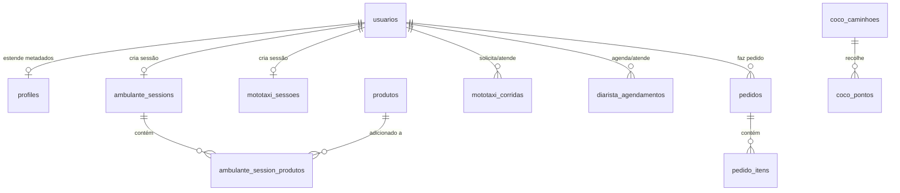

# Diagnóstico de Integração e Consistência da Plataforma UBT SuperApp

> **Status Geral da Plataforma:** Em produção parcial (Frontend hospedado na Vercel: [ubtservicos.vercel.app](https://ubtservicos.vercel.app/))  
> **Banco de Dados Oficial:** Supabase PostgreSQL (com tabelas e replicação em tempo real ativas)  
> **Versão do Diagnóstico:** 1.0 (Julho de 2026)  
> **Público-alvo:** Desenvolvedores e Agentes de IA (Lovable, Cursor, ChatGPT, Claude)

---

## 1. Visão Geral e Arquitetura do Projeto

A UBT Digital é uma plataforma multi-serviços (SuperApp) voltada para o fortalecimento de trabalhadores autônomos e comunidades de apoio mútuo em Ubatuba, SP. 

### Stack Tecnológica Base
*   **Frontend:** React, TypeScript, Vite
*   **Estilização (CSS):** Vanilla CSS + Tailwind CSS (com classes utilitárias em algumas páginas, mas centralizado em tokens customizados do `index.css`)
*   **Gerenciamento de Estado:** React Contexts (`RideContext` para Mototaxi, `AmbulantePedidoContext` para Ambulantes) + React Query
*   **Mapas e Geolocalização:** Leaflet (Mapas interativos leves e otimizados para mobile-first) com geocodificação offline integrada a um banco de CEPs de Ubatuba.
*   **Banco de Dados & Real-time:** Supabase (PostgreSQL + RLS + Channels em tempo real)

---

## 2. Supabase vs. Firebase: O Porquê de Ambos Existirem

Uma dúvida comum ao ler a base de código é a coexistência de pacotes e arquivos de configuração tanto do **Firebase Realtime Database** quanto do **Supabase**.

### O Racional Técnico
1.  **Origem (Firebase como Mock de Lovable):** O protótipo visual gerado inicialmente pela ferramenta Lovable usava o Firebase Realtime Database com chaves e credenciais genéricas/placeholders para simular o comportamento de banco de dados em tempo real (como chats, GPS de motoristas e status de pedidos).
2.  **Transição para o Supabase (Oficial):** O backend de produção foi completamente migrado para o **Supabase PostgreSQL**. As tabelas relacionais de produção, autenticação, controle de acesso (RLS) e sincronização GPS estão ativas e funcionando diretamente no Supabase.
3.  **Comportamento do Firebase no Codebase Atual:** 
    *   No arquivo [firebase.ts](file:///c:/Users/MacInBox/Documents/profissional/ubt-ag/site/ubt-superapp-launch-main/src/lib/firebase.ts), a inicialização verifica se a URL do banco possui o termo `"placeholder"`. Se sim, a instância do banco é definida como `null`.
    *   Nas páginas que realizam operações (ex: [DiaristaAgendarPage.tsx](file:///c:/Users/MacInBox/Documents/profissional/ubt-ag/site/ubt-superapp-launch-main/src/pages/DiaristaAgendarPage.tsx)), o fluxo tenta escrever no Supabase como prioridade primária e persistente. Uma chamada dinâmica secundária é feita para o Firebase, mas falha silenciosamente caso o banco esteja nulo, garantindo compatibilidade com o código legado de mock sem quebrar a tela.
    *   Alguns arquivos (como [AmbulantesOnboardingPage.tsx](file:///c:/Users/MacInBox/Documents/profissional/ubt-ag/site/ubt-superapp-launch-main/src/pages/AmbulantesOnboardingPage.tsx)) ainda importam refs do Firebase que não são mais utilizadas após a migração completa para o Supabase. Estes imports podem ser deletados com segurança (veja seção de Recomendações).

### Conclusão:
O **Supabase** é o único banco de dados oficial e persistente do backend. O Firebase no momento atua como código inerte/legado de fallback e pode ser gradualmente removido sem perda de funcionalidade.

---

## 3. Estrutura do Banco de Dados Supabase (Tabelas Ativas)

Todas as funcionalidades do backend foram mapeadas e implementadas nas seguintes tabelas do Supabase. O banco de dados já possui RLS (Row Level Security) configurado para desenvolvimento.



### Detalhamento das Tabelas

#### 1. Usuários e Autenticação
*   `public.usuarios`: Cadastro central de usuários (Clientes/Tomadores, Prestadores, Administradores). Campos: `id` (UUID), `nome`, `role`, `avatar_url`, `created_at`.
*   `public.profiles`: Tabela estendida sincronizada com as credenciais de autenticação (ligada a `auth.users`).

#### 2. CEPs e Geolocalização (Ubatuba)
*   `public.ceps_ubatuba`: Banco de dados contendo todos os **1.823 CEPs** da cidade de Ubatuba, com coordenadas de latitude/longitude e cache de endereços. Utilizado pelo serviço de geocodificação customizado [geoService.ts](file:///c:/Users/MacInBox/Documents/profissional/ubt-ag/site/ubt-superapp-launch-main/src/lib/geoService.ts) para evitar requisições repetitivas a APIs externas e permitir mapeamento Leaflet preciso em tempo real na cidade.

#### 3. Categoria: Mototaxi e Caronas
*   `public.mototaxi_sessoes`: Rastreamento em tempo real dos prestadores de Mototaxi que estão online. Campos: `prestador_id`, `is_online`, `lat`, `lng`, `updated_at`.
*   `public.mototaxi_corridas`: Corridas solicitadas por tomadores. Campos: `id`, `tomador_id`, `prestador_id`, `status` (searching, accepted, in_progress, completed, cancelled), `type` (carona, entrega), `origin` (JSONB), `destination` (JSONB), `distance_km`, `duration_min`, `estimated_price`, `final_price`, `payment_method`.

#### 4. Categoria: Diaristas
*   `public.diarista_perfis`: Perfis detalhados de diaristas com preferências de preço por metro quadrado, materiais e descrição de serviços.
*   `public.diarista_agendamentos`: Agendamentos de serviços efetuados pelos tomadores. Campos: `id`, `tomador_id`, `diarista_id`, `status` (pending_confirm, active, completed, cancelled), `data`, `hora`, `local` (JSONB com endereço e tamanho em m²), `valor_total`.

#### 5. Categoria: Ambulantes (Praias)
*   `public.produtos`: Catálogo geral de produtos (Água de coco, milho, espetinho, açaí, artesanato, etc.).
*   `public.ambulante_sessions`: Sessões ativas de vendedores ambulantes na praia, contendo sua geolocalização e modalidade (delivery na areia, local fixo ou ambos).
*   `public.ambulante_session_produtos`: Associação de quais produtos e preços específicos cada ambulante está vendendo em sua sessão ativa.
*   `public.pedidos` & `public.pedido_itens`: Registro de vendas e pedidos enviados pelos tomadores para entrega de produtos na areia.

#### 6. Responsabilidade Ambiental: Côco & Cia
*   `public.coco_caminhoes`: Cadastro de caminhões de lixo/reciclagem ecológicos da ONG. Campos: `id`, `plate` (placa), `apelido`, `is_online` (GPS ativo), `lat`, `lng`, `collections_today`, `pix_key`.
*   `public.coco_pontos`: Pontos de coleta de resíduos recicláveis marcados pelos tomadores de serviço no mapa. Campos: `id`, `tomador_id`, `lat`, `lng`, `address`, `material` (plástico, vidro, misto, orgânico), `status` (aguardando, confirmado, coletado, recusado), `caminhao_id`.

---

## 4. Estado dos Dados: O que está Integrado (Supabase) vs. Mockado

O backend da plataforma está parcialmente completo. Os fluxos prioritários (MVP) estão totalmente conectados ao Supabase, enquanto os fluxos secundários ("Fase 2") ou painéis analíticos ainda utilizam mocks locais (`src/mocks`).

### 📊 Tabela de Status dos Módulos

| Módulo/Serviço | Estado da Integração | Onde estão os Mocks restantes? |
| :--- | :--- | :--- |
| **Autenticação & Cadastro** | **Integrado** (Supabase Auth) | Fluxo de login por biometria (Passkey/WebAuthn) e Link Mágico SMS usam simulações locais no frontend. |
| **Mototaxi (Tomador & Prestador)** | **Integrado** (Supabase + Realtime Channels) | O fluxo em tempo real de busca e corrida é real. Sem mocks residuais no fluxo principal. |
| **Diaristas (Busca & Onboarding)** | **Integrado** (Supabase) | Perfis padrão carregam de `seed_diaristas_reais.sql`. Dados de materiais padrão carregam de [diaristasMateriais.ts](file:///c:/Users/MacInBox/Documents/profissional/ubt-ag/site/ubt-superapp-launch-main/src/mocks/diaristasMateriais.ts). |
| **Ambulantes (Catálogo & Pedidos)** | **Integrado** (Supabase) | O catálogo de produtos do ambulante usa dados persistentes no Supabase. O avanço de status de pedido do tomador usa uma simulação temporária baseada em timeouts no frontend se o prestador não atualizar. |
| **Côco & Cia (Mapas & Coleta)** | **Integrado** (Supabase) | Os caminhões e pontos de coleta inseridos na interface escrevem e leem do banco real. Materiais padrão importados de [cocoMateriais.ts](file:///c:/Users/MacInBox/Documents/profissional/ubt-ag/site/ubt-superapp-launch-main/src/mocks/cocoMateriais.ts). |
| **Beleza (Fase 2)** | 🔴 **Mockado** / Não Implementado | Fluxo visual de agendamento e onboarding não conectado a tabelas específicas. |
| **Surf (Fase 2)** | 🔴 **Mockado** / Não Implementado | Sem suporte a tabelas no banco de dados. |
| **Aulas (Fase 2)** | 🔴 **Mockado** / Não Implementado | Sem suporte a tabelas no banco de dados. |
| **Admin: Arbitragem & Disputas** | 🟡 **Parcialmente Mockado** | Exibição de disputas consome dados de [adminData.ts](file:///c:/Users/MacInBox/Documents/profissional/ubt-ag/site/ubt-superapp-launch-main/src/mocks/adminData.ts) (`MOCK_TICKETS`). As ações de reembolso/resolução afetam apenas estados temporários. |
| **Admin: Clientes e Transações** | **Integrado** (Supabase) | O painel exibe dados de usuários cadastrados e calcula faturamento e transações com base nas tabelas reais do Supabase. |
| **Admin: Gestão de Conteúdo** | 🟡 **Parcialmente Mockado** | Banners de sorteio e paletas de cores salvam estados no `localStorage` local para simulação. |

---

## 5. Diagnóstico de Consistência e Nomes de Páginas

Para evitar que futuras IAs criem arquivos duplicados ou modifiquem componentes errados, aqui está um mapeamento das discrepâncias entre a especificação teórica ([UBT_Sitemap_v2_0.md](file:///C:/Users/MacInBox/Documents/profissional/ubt-ag/mds/UBT_Sitemap_v2_0.md)) e a implementação real no roteador ([App.tsx](file:///c:/Users/MacInBox/Documents/profissional/ubt-ag/site/ubt-superapp-launch-main/src/App.tsx)).

### Inconsistências de Rota e Nomes de Arquivo

1.  **Prefixos `/pro` vs `/app/prestador`:**
    *   *Especificação:* O sitemap especifica rotas como `/pro/home`, `/pro/calendar`, `/pro/stock`.
    *   *Implementação:* Todas as rotas de prestador foram mapeadas sob `/app/prestador/...` (ex: `/app/prestador/home`, `/app/prestador/mototaxi/online`).
    *   *Orientação:* Manter o padrão `/app/prestador/...` para manter o isolamento de escopo no middleware de rotas, atualizando as referências do sitemap.
2.  **Unificação de Histórico e Prêmios no "Gerenciar":**
    *   *Especificação:* Rotas separadas `/app/history` (Histórico) e `/app/prizes` (Sorteios).
    *   *Implementação:* Ambos foram unificados em abas dentro de [GerenciarPage.tsx](file:///c:/Users/MacInBox/Documents/profissional/ubt-ag/site/ubt-superapp-launch-main/src/pages/GerenciarPage.tsx) na rota `/app/gerenciar`. Isso simplifica a navegação e economiza requisições.
3.  **Telas de "Fase 2" (Beleza, Surf, Aulas):**
    *   *Especificação:* Sitemap detalha fluxos específicos para estas categorias.
    *   *Implementação:* Não possuem arquivos de página correspondentes. Atualmente redirecionam ou exibem estados simulados. Novas IAs precisam criar essas páginas do zero caso decidam implementá-las.
4.  **Admin pricing e disputes:**
    *   *Especificação:* `/admin/pricing` e `/admin/disputes`.
    *   *Implementação:* Mapeado em `/admin/preco` e `/admin/arbitragem` respectivamente.

---

## 6. Especificações de Design e Tokens Visuais Activos

Para manter a consistência de novos elementos criados por outras IAs:

*   **Tipografia:** 
    *   Títulos e Display: `Syne` (Font-weight: 700/800)
    *   Corpo de texto e inputs: `DM Sans` (Font-weight: 400/500/600)
*   **Modos de Interface Nativa (Importante para consistência de UI):**
    *   **Tomador de Serviço:** Fundo escuro (Dark Mode padrão, `--navy` `#0B1B3E`).
    *   **Prestador de Serviço:** Fundo claro (Light Mode padrão, `--gray-50` `#F7F8FA` / `--white` `#FFFFFF`).
*   **Cores Semânticas Estritas:**
    *   🟢 **Verde** (`#0DB87E`) -> Confirmação, Dinheiro Recebido, Status Disponível.
    *   🟡 **Âmbar** (`#F5A623`) -> Aguardando, Atenção, Últimas Unidades.
    *   🔴 **Vermelho** (`#E84040`) -> Erro, Cancelamento, Indisponibilidade.
    *   🔵 **Azul** (`#2B6EE8`) -> Informação, Links de Navegação.

---

## 7. Instruções e Prompts Recomendados para Outras IAs

Caso você queira utilizar ferramentas como o **Lovable**, **Cursor** ou **Claude** para avançar no projeto, copie e cole as seguintes instruções no prompt de contexto da ferramenta:

### Prompt de Contexto Base para Avanço do Projeto
```text
Você está trabalhando no projeto UBT SuperApp, um PWA responsivo em React + TypeScript + Vite integrado ao Supabase.
O projeto utiliza um banco de CEPs de Ubatuba geocodificado localmente para guiar mapas do Leaflet.

Por favor, siga estas diretrizes de desenvolvimento:
1. BANCO DE DADOS: O Supabase é o único banco oficial. Não utilize ou configure novas conexões com o Firebase. Ignore os imports antigos do Firebase nas páginas ou faça a limpeza deles se estiver editando os arquivos.
2. ROTAS: A área do prestador fica sob "/app/prestador/..." e a área do tomador sob "/app/...". Não crie rotas sob "/pro/...".
3. DESIGN SYSTEM: Respeite a tipografia (Syne para títulos, DM Sans para corpo) e as cores semânticas (Verde #0DB87E para sucesso/dinheiro, Âmbar #F5A623 para pendências, Vermelho #E84040 para erros, Azul #2B6EE8 para info).
4. MODOS DE TEMA: Telas do Tomador devem obrigatoriamente usar Dark Mode (fundo Navy #0B1B3E). Telas do Prestador devem usar Light Mode (fundo Branco/Cinza claro).
5. GEOLOCALIZAÇÃO: Para geocodificar endereços ou buscar CEPs, use a API interna do 'geoService.ts' que consome a tabela 'ceps_ubatuba' no Supabase para manter o mapa do Leaflet rápido e com cache local.
```

### Prompt para Remoção de Código Morto do Firebase (Opcional)
```text
Remova as importações e referências legadas do Firebase nos arquivos de onboarding e agendamento (como 'AmbulantesOnboardingPage.tsx' e 'DiaristaAgendarPage.tsx'), garantindo que todas as escritas e leituras de dados persistentes fiquem unicamente centralizadas nas chamadas de API do Supabase e que falhas ou ausências do Firebase não gerem warnings de console desnecessários.
```

---
*UBT Digital · Relatório de Diagnóstico de Consistência e Backend · Confidencial*
