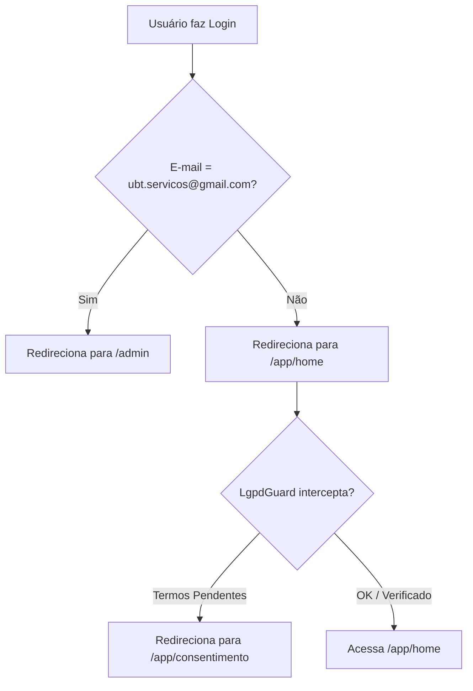

# Audit 03 — Routing and RBAC Security Architecture

Este documento apresenta a análise de segurança de rotas, controle de acesso baseado em papéis (RBAC), mecanismos de guarda (guards) e fluxos de redirecionamento pós-login no PWA da UBT.

---

## 1. Árvore de Rotas (Router)

A estrutura de rotas da aplicação em [`App.tsx`](file:///C:/Users/MacInBox/Documents/profissional/ubt/pwa/src/App.tsx) é dividida em três níveis de acesso principais:

### 1.1. Rotas Públicas (Acesso Livre)
- `/`: Landing Page de captação e waitlist (Capítulos I a VI).
- `/experience`: Página conceito da plataforma ("Concept Experience").
- `/login`: Tela de autenticação por e-mail e senha.
- `/cadastro`: Cadastro de novos usuários.
- `/recuperar-senha`: Fluxo de recuperação de senha por e-mail.
- `/admin/login`: Página de autenticação do painel de administração.

### 1.2. Rotas Privadas do App (Protegidas por LgpdGuard)
Todas as páginas internas do SuperApp sob o prefixo `/app/` exigem autenticação do usuário e consentimento LGPD ativo. Exemplos principais:
- `/app/home`: Hub principal do cliente/prestador.
- `/app/mototaxi`: Solicitação de mototáxi (visão tomador).
- `/app/prestador/home`: Dashboard principal de controle do prestador de serviço.
- `/app/prestador/mototaxi/*`: Onboarding, telemetria online e corridas do mototaxista.
- `/app/ambulantes/*`: Catálogos, descoberta de ambulantes e carrinho de compras.
- `/app/diaristas/*`: Busca, perfis e agendamento de diaristas.

### 1.3. Rotas Administrativas (Protegidas por AdminRoute + adminGuard)
Páginas sob o prefixo `/admin/` para gestão operacional e financeira do SuperApp. Exemplos:
- `/admin`: Dashboard consolidado de métricas e saúde do sistema.
- `/admin/clientes`, `/admin/financeiro`, `/admin/payments`, `/admin/payouts`, `/admin/disputes`.
- `/admin/split`: Configurações de rateio financeiro da plataforma.
- `/admin/permissoes`: Gestão de regras RBAC.

---

## 2. Guardas de Rota (Route Guards)

A segurança e restrição de acesso nas rotas são coordenadas por dois componentes guardiões principais:

### 2.1. `LgpdGuard` ([`LgpdGuard.tsx`](file:///C:/Users/MacInBox/Documents/profissional/ubt/pwa/src/components/app/LgpdGuard.tsx))
- **Verificação de Login:** Invoca `supabase.auth.getUser()`. Se o usuário não estiver autenticado, intercepta a rota e redireciona síncronamente para `/login`.
- **Verificação de Consentimento LGPD:** Consulta a tabela `user_consents`. O usuário só recebe permissão para prosseguir caso tenha aceito as três políticas obrigatórias (`terms_v1`, `privacy_v1` e `cookies_v1`).
- **Otimização por Cache:** Após validação inicial bem-sucedida, o status de conformidade é cacheado no `sessionStorage` (`ubt_lgpd_verified_[user_id] = "true"`) para eliminar queries de banco repetitivas durante a navegação.
- **Redirecionamento:** Se houver termos pendentes, redireciona o usuário para a página de consentimento `/app/consentimento`.

### 2.2. `AdminRoute` ([`AdminRoute.tsx`](file:///C:/Users/MacInBox/Documents/profissional/ubt/pwa/src/components/admin/AdminRoute.tsx))
- **Verificação de Perfil:** Busca o campo `role` do usuário na tabela `public.usuarios`.
- **Super Admin Bypass:** Se o e-mail logado for `ubt.servicos@gmail.com`, o papel é forçado para `super_admin`, liberando acesso irrestrito a qualquer recurso ou tela administrativa.
- **Acesso Baseado em Roles:** Caso o papel do usuário esteja na lista de `allowedRoles` da rota, o acesso é autorizado.
- **Acesso Baseado em Permissão Fina:** Se a rota exigir uma permissão específica (parâmetro `permission`), o componente invoca a RPC do banco de dados `supabase.rpc("has_permission", { p_permission_code })` para verificar a atribuição no banco de dados.

> [!WARNING]
> **Dívida Técnica Identificada:** No arquivo `App.tsx`, a função helper `adminGuard` foi declarada recebendo apenas dois parâmetros: `adminGuard(el, allowedRoles)`. Porém, rotas como `/admin/configuracoes`, `/admin/quality` e `/admin/security` chamam o helper passando um terceiro argumento de permissão (ex: `adminGuard(<AdminConfiguracoesPage />, ["admin"], "config.edit")`). Devido a essa assinatura incompleta do helper, o parâmetro de permissão fina é ignorado e nunca repassado para o `AdminRouteProps`, fazendo com que a validação de permissões finas no banco não seja executada nessas rotas específicas.

---

## 3. Redirecionamentos Pós-Login

O fluxo de decisão de destino pós-autenticação em [`Login.tsx`](file:///C:/Users/MacInBox/Documents/profissional/ubt/pwa/src/pages/Login.tsx) obedece à seguinte árvore de redirecionamento:

### 3.1. Tratamento por Role nas Dashboards de Usuários
Após alcançar `/app/home`, a visualização ou navegação de prestadores se ajusta conforme as qualificações:
- **Redirecionamento ao Painel do Prestador:** Se o usuário possui papéis administrativos ou operacionais cadastrados, ele pode acessar a rota `/app/prestador/home`.
- **Verificação de KYC (Mototáxi):** Se o prestador tenta entrar no modo online de mototáxi, a aplicação valida se `user.kycStatus === "approved"`. Usuários com KYC sob avaliação são redirecionados automaticamente para `/app/prestador/mototaxi/kyc-pending`.
- **Verificação de Onboarding Operacional (Ambulantes & Diaristas):** A liberação dos painéis de controle de pedidos/agendas checa sinalizadores persistentes no localStorage (`amb_session_[user_id]`, `diarista_perfil_[user_id]`). Usuários sem onboarding ativo são guiados para preencher as configurações em `/onboarding`.
- **Verificação de Bloqueio Administrativo:** Se o usuário tiver um status de suspensão ativo em `user.status`, as regras de negócio em `getStatusRules()` bloqueiam o acesso a solicitações, chats e pagamentos, renderizando uma tela de suspensão total.
