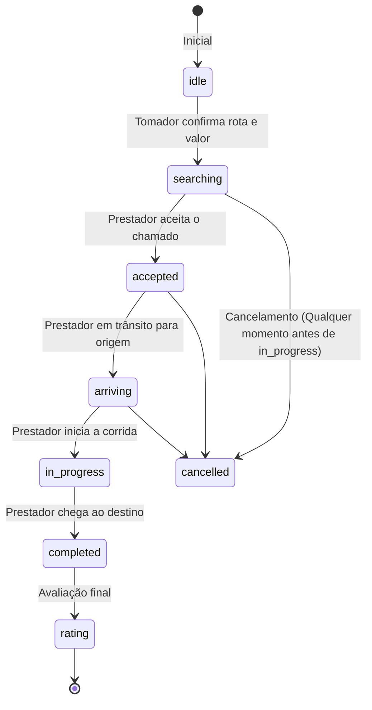

# Audit 05 — Mototaxi Module & Map Infrastructure

Este documento detalha o funcionamento operacional, a máquina de estados de corridas, o fluxo do passageiro (tomador), o fluxo do motorista (prestador) e as especificações de mapas e georreferenciamento no SuperApp UBT.

---

## 1. Máquina de Estados de Corridas (`RideState` / `mototaxi_corridas.status`)

O ciclo de vida completo de uma solicitação de mototáxi obedece à seguinte máquina de estados no banco de dados e nos contextos do React:

### 1.1. Detalhes de Transição de Estado
- **`idle` (Ocioso):** Estado inicial. O tomador define a modalidade (carona ou entrega), digita endereços e visualiza a rota simulada com a estimativa de preço.
- **`searching` (Buscando):** O pedido é salvo na tabela `mototaxi_corridas` com `status='searching'`. Uma busca ativa por geolocalização é iniciada em background. O tomador visualiza um countdown de 60 segundos.
- **`accepted` (Aceito):** Um mototaxista aceita a corrida no painel. O status é alterado para `accepted`, salvando o ID do motorista em `prestador_id`.
- **`arriving` (Chegando):** O prestador está em trânsito ao local de origem. O tomador visualiza a telemetria do motorista em movimento no mapa.
- **`in_progress` (Em Andamento):** O motorista inicia a viagem fisicamente. O status muda para `in_progress`.
- **`completed` (Concluído):** O motorista encerra a corrida ao chegar no destino, enviando o `final_price` para a base.
- **`rating` (Avaliação):** Tela final de cashback, rateio e avaliação em estrelas do prestador.

---

## 2. Fluxo do Tomador (Passageiro)

Mapeado a partir de [`MototaxiTomador.tsx`](file:///C:/Users/MacInBox/Documents/profissional/ubt/pwa/src/pages/MototaxiTomador.tsx):

1. **Captura de Localização:** A origem do usuário é obtida automaticamente via geolocalização do dispositivo.
2. **Definição de Destino:** O usuário digita o endereço de destino no input. O componente aciona o debounce e busca correspondências em Ubatuba.
3. **Cálculo de Preço:** A distância entre origem e destino é calculada utilizando a fórmula de Haversine em memória para obter a quilometragem estimativa. O valor da corrida é calculado pela função `calcPrice(distanceKm)`:
   - Aplica taxa de serviço, taxa base e quilometragem rodada.
4. **Criação da Corrida:** Clica em "Confirmar Pedido". A aplicação gera um registro em `mototaxi_corridas` contendo:
   - `origin` e `destination` (como objetos JSON contendo texto e coordenadas).
   - `estimated_price`.
   - `status` inicializado como `'searching'`.
5. **Acompanhamento:** A tela do tomador fica escutando atualizações via WebSocket de Supabase em tempo real no canal do ID da corrida. Ao detectar a mudança de status, atualiza os painéis correspondentes (Accepted -> In Progress -> Completed).

---

## 3. Fluxo do Prestador (Motorista)

Mapeado a partir de [`PrestadorMototaxiOnline.tsx`](file:///C:/Users/MacInBox/Documents/profissional/ubt/pwa/src/pages/PrestadorMototaxiOnline.tsx) e [`PrestadorMototaxiActive.tsx`](file:///C:/Users/MacInBox/Documents/profissional/ubt/pwa/src/pages/PrestadorMototaxiActive.tsx):

1. **Entrar no Modo Online:**
   - A aplicação verifica se o KYC do prestador está aprovado (`kycStatus === 'approved'`).
   - Captura a posição GPS atual. O `GeofenceService` valida se a coordenada está dentro do polígono limítrofe de Ubatuba. Se estiver fora, bloqueia o acesso e exibe alerta.
   - Cria/atualiza o status de sessão em `mototaxi_sessoes` com `{ is_online: true, lat, lng }`.
2. **Recebimento de Chamados:**
   - Ativa um listener WebSocket na tabela `mototaxi_corridas` filtrando por registros com `status=searching`.
   - Ao receber o chamado, exibe o modal do pedido com temporizador de aceitação de 60 segundos e vibrador háptico do aparelho.
3. **Aceitação e Execução:**
   - Ao clicar em "Aceitar", executa um `UPDATE` no registro da corrida definindo `status='accepted'` e `prestador_id=user.uid`.
   - Redireciona para a tela de corrida ativa, onde atualiza as coordenadas do motorista em tempo real no banco a cada ciclo do `navigator.geolocation.watchPosition` (telemetria).
   - Controla a viagem através de botões manuais:
     - "Cheguei na Origem" (transita internamente para fase de embarque).
     - "Iniciar Corrida" (efetua `UPDATE` no status para `in_progress`).
     - "Concluir Corrida" (efetua `UPDATE` no status para `completed` definindo o preço final).

---

## 4. Infraestrutura de Mapas (React-Leaflet)

O SuperApp utiliza a biblioteca **React-Leaflet v4** acoplada ao Leaflet v1.9.

### 4.1. Conexão do AddressSearch com o geoService
- O componente [`AddressSearch.tsx`](file:///C:/Users/MacInBox/Documents/profissional/ubt/pwa/src/components/AddressSearch.tsx) encapsula a caixa de texto de endereços.
- Contém um **debounce de 400ms** na digitação do usuário para evitar requisições desnecessárias a servidores terceiros.
- Dispara a função `searchAddresses(v)` em [`geoService.ts`](file:///C:/Users/MacInBox/Documents/profissional/ubt/pwa/src/lib/geoService.ts), que resolve a pesquisa:
  - Consulta cache local.
  - Consulta cache em banco (`endereco_cache`).
  - Consulta APIs remotas (Nominatim / Mapbox / Google Maps Geocoding).
- Retorna uma lista de sugestões `{ label, lat, lng }`. O clique no item dispara o callback `onChange` populando as coordenadas no formulário principal.

### 4.2. Gotchas e Problemas de Re-renderização no Leaflet
O ciclo de vida do Leaflet possui especificidades que exigem tratamentos personalizados na aplicação:
- **Imutabilidade de Atributos do MapContainer:** No React-Leaflet, as propriedades `center` e `zoom` do componente `<MapContainer>` são imutáveis após a montagem do componente. Se o estado de origem mudar e o componente pai re-renderizar, o mapa não se deslocará.
  - *Solução implementada:* Criação do subcomponente `<FlyTo center={...} />`. Ele consome a instância interna do Leaflet via `useMap()` e dispara de forma imperativa `map.flyTo(center)` sempre que as coordenadas mudam.
- **Vazamento de Instâncias de Marker/Icons:** Os marcadores padrão do Leaflet procuram imagens locais em caminhos estáticos (`marker-icon.png`). Como o build do Vite gera hashes no nome dos arquivos, as imagens padrão quebravam (gerando ícones vazios).
  - *Solução implementada:* Importação de um patch especial ([`leafletFix.ts`](file:///C:/Users/MacInBox/Documents/profissional/ubt/pwa/src/lib/leafletFix.ts)) que reconfigura as URLs dos marcadores apontando para caminhos absolutos ou definindo ícones SVG customizados (`tomadorIcon`, `motoIcon`, `destinoIcon`) criados em [`mapIcons.ts`](file:///C:/Users/MacInBox/Documents/profissional/ubt/pwa/src/lib/mapIcons.ts).
- **Carga de Redesenho por Renderizações Frequentes:** O contador de segundos ou alterações de chat no painel de corrida ativo forçam re-renders constantes no componente pai. Se o mapa não estiver isolado, o Canvas do Leaflet sofrerá flashes e re-downloads de tiles de mapa.
  - *Solução implementada:* O mapa é isolado em componentes dedicados ([`MototaxiMap.tsx`](file:///C:/Users/MacInBox/Documents/profissional/ubt/pwa/src/components/MototaxiMap.tsx) ou [`PrestadorMapLight`](file:///C:/Users/MacInBox/Documents/profissional/ubt/pwa/src/components/prestador/PrestadorMapLight.tsx)) e tem suas dependências de atualização de props limitadas unicamente às coordenadas geográficas da rota e da moto.
