# Mapeamento da Arquitetura e Taxonomia Atual do Módulo Admin

Este documento fornece um mapeamento detalhado da estrutura, rotas, taxonomia de menus, regras de controle de acesso (RBAC) e falhas de coesão do módulo administrativo no Superapp UBT.

---

## 1. Rotas Administrativas Existentes

As seguintes rotas e views estão associadas ao painel administrativo e à área de controle de acessos da plataforma (mapeadas a partir de `src/App.tsx`):

### A. Autenticação Administrativa
* `/admin/login`: Página de login administrativa (`AdminLoginPage.tsx`)

### B. Painel de Controle Principal (Dashboard & Monitoramento)
* `/admin`: Dashboard consolidado de indicadores (`AdminDashboardPage.tsx`)
* `/admin/health`: Painel de monitoramento da saúde e status do sistema (`AdminHealthCenterPage.tsx`)
* `/admin/operacoes`: Visualização em tempo real das corridas e serviços operacionais (`AdminOperacoesPage.tsx`)

### C. Gestão de Contas, Perfis & KYC
* `/admin/clientes`: Lista completa de usuários (tomadores e prestadores) cadastrados (`AdminClientesPage.tsx`)
* `/admin/clientes/:id`: Página de detalhes e auditoria de perfil de um cliente/usuário (`AdminClienteDetailPage.tsx`)
* `/admin/kyc-pendentes`: Lista de prestadores aguardando validação de KYC e documentos (`AdminKycListPage.tsx`)
* `/admin/kyc/:id`: Detalhe da documentação de um prestador específico para aprovação/rejeição (`AdminKycDetailPage.tsx`)
* `/admin/waitlist`: Fila de pré-cadastro e lista de convites da lista de espera (`AdminWaitlistPage.tsx`)

### D. Financeiro, Tarifação & Split de Pagamentos
* `/admin/financeiro`: Console de faturamento global, volume transacionado e saldos (`AdminFinanceiroPage.tsx`)
* `/admin/payments`: Detalhamento e logs individuais de pagamentos recebidos via Mercado Pago (`AdminPaymentsPage.tsx`)
* `/admin/payouts`: Módulo de liberação e conciliação de saques solicitados por prestadores (`AdminPayoutsPage.tsx`)
* `/admin/refunds`: Módulo para visualização e execução de estornos de transações (`AdminRefundsPage.tsx`)
* `/admin/split`: Parametrização global de taxas de serviço da plataforma (`AdminSplitPage.tsx`)
* `/admin/sorteio/1-5`: Sorteio do trabalhador (benefício e retenção prestador) (`AdminSorteioTrabPage.tsx`)
* `/admin/sorteio/1-11`: Sorteio do consumidor (cashback e retenção tomador) (`AdminSorteioConsPage.tsx`)
* `/admin/preco`: Configuração de precificação dinâmica, multiplicadores por demanda e geofencing (`AdminPrecoPage.tsx`)

### E. Mediações, Cancelamentos & Resolução de Conflitos
* `/admin/disputes`: Visualização e tratamento de mediações/contestações abertas (`AdminDisputesPage.tsx`)
* `/admin/cancellations`: Registros detalhados de taxas e logs de cancelamentos de serviços (`AdminCancellationsPage.tsx`)
* `/admin/arbitragem`: Painel de resolução de arbitragens e estornos administrativos de disputas (`AdminArbitragemPage.tsx`)

### F. Governança, Permissões & Relações
* `/admin/lgpd`: Relatórios de auditoria de consentimento de privacidade e termos (`AdminLgpdPage.tsx`)
* `/admin/auditoria`: Logs detalhados de ações e alterações administrativas (`AdminAuditPage.tsx`)
* `/admin/permissoes`: Painel de regras RBAC de permissões por perfil (`AdminPermissoesPage.tsx`)
* `/admin/configuracoes`: Ajustes e parâmetros do sistema global (`AdminConfiguracoesPage.tsx`)
* `/admin/quality`: Controle de qualidade de serviços e avaliações (`AdminQualityCenterPage.tsx`)
* `/admin/security`: Auditoria de ameaças, acessos anômalos e logs de segurança (`AdminSecurityCenterPage.tsx`)
* `/admin/entidades`: Administração de associações de bairro e cadastros governamentais (`AdminEntidadesPage.tsx`)

### G. Verticais de Negócio & Conteúdo
* `/admin/conteudo`: Painel de gerenciamento de textos de ajuda, termos e informativos da plataforma (`AdminConteudoPage.tsx`)
* `/admin/coco`: Módulo gerencial da operação do parceiro "Côco & Cia" (`AdminCocoPage.tsx`)
* `/admin/diaristas`: Módulo gerencial operacional da vertical de Diaristas (`AdminDiaristasPage.tsx`)
* `/wiki`: Portal de documentação e manuais da equipe interna (`WikiIndexPage.tsx`)

---

## 2. Taxonomia e Menus Administrativos

O menu lateral administrativo (`Sidebar` localizado em `src/layouts/AdminLayout.tsx`) está estruturado a partir da lista estática `NAV_ITEMS`. Abaixo, a representação da taxonomia atual e as roles que têm acesso a cada menu:

```mermaid
graph TD
    A[Sidebar Admin] --> B(Módulos Operacionais)
    A --> C(Módulos Financeiros)
    A --> D(Segurança & Governança)
    A --> E(Verticais & Configurações)

    B --> B1[Dashboard /admin]:::opRole
    B --> B2[Saúde da Plataforma /admin/health]:::opsMgrRole
    B --> B3[KYCs Pendentes /admin/kyc-pendentes]:::opRole
    B --> B4[Clientes /admin/clientes]:::opRole
    B --> B5[Operações Realtime /admin/operacoes]:::opRole
    B --> B6[Fila de Espera /admin/waitlist]:::mktRole

    C --> C1[Financeiro /admin/financeiro]:::finRole
    C --> C2[Pagamentos /admin/payments]:::finRole
    C --> C3[Saques / Payouts /admin/payouts]:::finRole
    C --> C4[Estornos /admin/refunds]:::finRole
    C --> C5[Cancelamentos /admin/cancellations]:::finRole
    C --> C6[Taxa de Serviço /admin/split]:::finRole

    D --> D1[Mediações /admin/disputes]:::modRole
    D --> D2[Privacidade / LGPD /admin/lgpd]:::saRole
    D --> D3[Auditoria / Logs /admin/auditoria]:::saRole
    D --> D4[Antifraude /admin/antifraude]:::adminRole
    D --> D5[Permissões RBAC /admin/permissoes]:::adminRole
    D --> D6[Security Center /admin/security]:::adminRole

    E --> E1[Configurações /admin/configuracoes]:::adminRole
    E --> E2[Entidades /admin/entidades]:::opRole
    E --> E3[Preço Dinâmico /admin/preco]:::opRole
    E --> E4[Arbitragem /admin/arbitragem]:::modRole
    E --> E5[Conteúdo /admin/conteudo]:::opRole
    E --> E6[Côco & Cia /admin/coco]:::opRole
    E --> E7[Diaristas /admin/diaristas]:::opRole

    classDef opRole fill:#18181B,stroke:#00FF66,stroke-width:1px,color:#fff;
    classDef finRole fill:#18181B,stroke:#2B6EE8,stroke-width:1px,color:#fff;
    classDef modRole fill:#18181B,stroke:#E84040,stroke-width:1px,color:#fff;
    classDef saRole fill:#18181B,stroke:#F39C12,stroke-width:1px,color:#fff;
    classDef adminRole fill:#18181B,stroke:#9B59B6,stroke-width:1px,color:#fff;
    classDef mktRole fill:#18181B,stroke:#00D2D3,stroke-width:1px,color:#fff;
    classDef opsMgrRole fill:#18181B,stroke:#FF7979,stroke-width:1px,color:#fff;
```

### Detalhamento das Opções do Menu e Restrições RBAC

| Opção do Menu | Rota Associada | Roles Permitidas | Finalidade |
| :--- | :--- | :--- | :--- |
| **Dashboard** | `/admin` | `operator`, `financeiro`, `moderador`, `admin`, `super_admin` | Painel de controle e KPIs principais |
| **Saúde da Plataforma** | `/admin/health` | `operations_manager`, `operator`, `admin`, `super_admin` | Monitoramento de serviços e integridade |
| **KYCs Pendentes** | `/admin/kyc-pendentes` | `operator`, `admin`, `super_admin` | Moderação e aprovação de novos cadastros |
| **Clientes** | `/admin/clientes` | `operator`, `moderador`, `admin`, `super_admin` | Visualização de contas de usuários |
| **Financeiro** | `/admin/financeiro` | `financeiro`, `admin`, `super_admin` | Relatórios de receita e split |
| **Pagamentos** | `/admin/payments` | `financeiro`, `admin`, `super_admin` | Registro de transações individuais |
| **Saques / Payouts** | `/admin/payouts` | `financeiro`, `admin`, `super_admin` | Gestão de saques do prestador |
| **Mediações** | `/admin/disputes` | `moderador`, `admin`, `super_admin` | Gestão de disputas |
| **Estornos** | `/admin/refunds` | `financeiro`, `admin`, `super_admin` | Execução de reembolsos |
| **Cancelamentos** | `/admin/cancellations` | `operator`, `financeiro`, `admin`, `super_admin` | Logs e auditoria de cancelamentos |
| **Operações Realtime** | `/admin/operacoes` | `operator`, `admin`, `super_admin` | Acompanhamento de corridas ativas |
| **Privacidade / LGPD** | `/admin/lgpd` | `super_admin` | Auditoria de consentimentos |
| **Auditoria / Logs** | `/admin/auditoria` | `super_admin` | Logs do sistema e ações de admins |
| **Antifraude** | `/admin/antifraude` | `admin`, `super_admin` | Monitoramento e bloqueio de fraudes |
| **Analytics Operacional** | `/admin/analytics` | `admin`, `super_admin` | Gráficos e inteligência operacional |
| **Permissões RBAC** | `/admin/permissoes` | `admin`, `super_admin` | Controle de acessos e regras RPC |
| **Fila de Espera (Waitlist)**| `/admin/waitlist` | `marketing`, `admin`, `super_admin` | Gestão da fila de cadastros |
| **Quality Center** | `/admin/quality` | `admin`, `super_admin` | Indicadores de qualidade de prestadores |
| **Security Center** | `/admin/security` | `admin`, `super_admin` | Monitoramento e blindagem de segurança |
| **Configurações** | `/admin/configuracoes` | `admin`, `super_admin` | Variáveis globais do sistema |
| **Taxa de Serviço** | `/admin/split` | `financeiro`, `admin`, `super_admin` | Parametrização de repasses do split |
| **Entidades** | `/admin/entidades` | `operator`, `admin`, `super_admin` | Gestão de perfis institucionais |
| **Preço Dinâmico** | `/admin/preco` | `operator`, `admin`, `super_admin` | Ajuste de tarifas dinâmicas locais |
| **Arbitragem** | `/admin/arbitragem` | `moderador`, `admin`, `super_admin` | Resolução e punição de fraudadores |
| **Conteúdo** | `/admin/conteudo` | `operator`, `admin`, `super_admin` | Gestão de blogs e informativos |
| **Côco & Cia** | `/admin/coco` | `operator`, `admin`, `super_admin` | Painel da cooperativa parceira |
| **Diaristas** | `/admin/diaristas` | `operator`, `admin`, `super_admin` | Gestão da vertical de limpeza doméstica |

---

## 3. Componentes Principais e Relações

Os principais arquivos e componentes de layout estão organizados em:

* **Controlador de Rotas RBAC (`AdminRoute.tsx`):**
  * Controla se o usuário logado possui a role compatível com a rota requerida.
  * Dá permissão irrestrita se a role for `super_admin` ou se o e-mail for `ubt.servicos@gmail.com`.
  * Utiliza a função RPC do Supabase `has_permission` se a propriedade `permission` for declarada na rota.
* **Layout Unificado (`AdminLayout.tsx`):**
  * Provê a Sidebar estruturada com a listagem dinâmica de menus e filtragem de rotas que o usuário atual pode enxergar de acordo com a sua role.
  * Contém tratamento de logout administrativo direcionando para `/admin/login`.
  * Fornece o contêiner e o header para renderização dos subcomponentes de páginas administrativas.

---

## 4. Inconsistências de Código e Falhas de Coesão Mapeadas

Durante a auditoria profunda, identificamos as seguintes falhas estruturais de organização de arquivos, convenções de nomenclaturas e acoplamento no repositório:

### 4.1. Nomenclatura e Organização das Páginas na Pasta `/pages`
* **Localização Frouxa das Páginas de Configuração:**
  * Embora o painel administrativo global esteja totalmente contido em `src/pages/admin/`, as telas de configuração pessoal do usuário final (tomador ou prestador) e seus dados de Pix/Cartões (ex: `ConfigFinanceiroPage.tsx`, `ConfigPerfilPage.tsx`, `ConfigPrivacidadePage.tsx`) estão localizadas diretamente na pasta raiz `src/pages/` em vez de uma subpasta organizada `/pages/config/`.
* **Wiki Interna Fora do Padrão de Nomes:**
  * A página `WikiIndexPage.tsx` está localizada dentro da pasta `src/pages/admin/`, mas não segue o padrão de nomenclatura adotado por todas as outras páginas administrativas (que iniciam obrigatoriamente com o prefixo `Admin`).
* **Navegação do Wiki fora de `/admin`:**
  * O Wiki administrativo responde pela rota `/wiki` (em vez de `/admin/wiki`), o que quebra a taxonomia padronizada das rotas protegidas pelo layout do admin.

### 4.2. Acoplamento de Rotas no Arquivo Central `App.tsx`
* **Tamanho e Manutenabilidade:**
  * O arquivo `src/App.tsx` declara individualmente mais de 70 caminhos de rotas, misturando rotas públicas, rotas operacionais do PWA, rotas B2B de associação e todas as rotas administrativas. A falta de divisão em submódulos de roteamento dificulta a legibilidade e escalabilidade do projeto.

### 4.3. Falta de Agrupamento das Operações de Sorteio
* As páginas `AdminSorteioTrabPage.tsx` e `AdminSorteioConsPage.tsx` cuidam de uma funcionalidade comum (módulo de sorteios com base na retenção financeira), mas estão listadas como itens de rotas individuais e separadas no `App.tsx`, sem uma página gerencial unificada de Sorteios.
